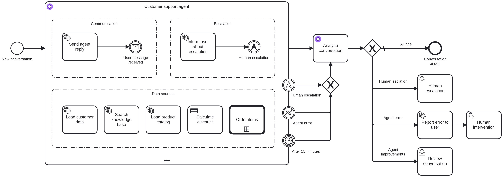

# ccon-2026-cpt-demo

Demo application for CPT (CCon 2026)

## Scenario

A live customer-support chat website for **Camunda Robotics** — a fictional producer of smart robots and robotic tools.
Users can contact a support agent to get help with product issues, upgrades, warranties, and more.



## Content

**Process resources**

- [`customer-support-agent.bpmn`](src/main/resources/bpmn/customer-support-agent.bpmn) — Main AI agent process: message
  loop, tool calls, guardrails, and human intervention
- [`order-process.bpmn`](src/main/resources/bpmn/order-process.bpmn) — Sub-process: creates and charges an order for
  upgrades or robots
- [`calculate-discount.dmn`](src/main/resources/bpmn/calculate-discount.dmn) — Decision table: loyalty-based discount
  calculation

**Process application**

- [`ProcessOrderApplication.java`](src/main/java/io/camunda/demo/ProcessOrderApplication.java) — Spring Boot entry
  point; deploys BPMN/DMN on startup
- [`workers/`](src/main/java/io/camunda/demo/workers) — Camunda job workers that implement the agent's tool calls
- [`services/`](src/main/java/io/camunda/demo/services) — Business-logic services backed by an H2 database

**Chat front-end**

- [`chat-app/src/`](chat-app/src) — Node.js/TypeScript server: starts process instances, relays chat messages via a job
  worker

**Tests** (using [Camunda Process Test](https://docs.camunda.io/docs/apis-tools/testing/getting-started/))

- [`AgentProcessTest`](src/test/java/io/camunda/demo/unitTests/AgentProcessTest.java) — Unit test: happy-path flow
  through the agent process with mocked workers
- [`AgentToolCallsTest`](src/test/java/io/camunda/demo/unitTests/AgentToolCallsTest.java) — Unit test: verifies each
  tool-call worker is invoked with the correct variables
- [`AgentGuardrailsTest`](src/test/java/io/camunda/demo/unitTests/AgentGuardrailsTest.java) — Unit test: guardrail paths
- [`DiscountDecisionTest`](src/test/java/io/camunda/demo/unitTests/DiscountDecisionTest.java) — Unit test: unit tests
  for the discount DMN table
- [`AgentUnitJsonTest`](src/test/java/io/camunda/demo/unitTests/AgentUnitJsonTest.java) — Unit test: same unit tests
  driven from JSON test-case files
- [`AgentIntegrationTest`](src/test/java/io/camunda/demo/integrationTests/AgentIntegrationTest.java) — Integration test:
  end-to-end with a real LLM (AWS Bedrock) and real data services
- [`AgentIntegrationJsonTest`](src/test/java/io/camunda/demo/integrationTests/AgentIntegrationJsonTest.java) —
  Integration test: same end-to-end scenarios driven from JSON test-case files

## Automated tests

Run the automated tests from the project root:

```bash
# Run all automated tests
mvn test

# Run only unit tests
mvn -Dskip.integration.tests=true test

# Run only integration tests
mvn -Dskip.unit.tests=true test
```

Notes:

- The Maven build also builds the chat front-end in `chat-app/` as part of the test run.
- The integration tests use a real LLM via AWS Bedrock and require these environment variables:

```bash
export AWS_BEDROCK_ACCESS_KEY=YOUR_ACCESS_KEY
export AWS_BEDROCK_SECRET_KEY=YOUR_SECRET_KEY
```

- The process tests start their own Camunda test runtime during the Maven test run, so you do not need to start Camunda 8 Run for the automated tests.

## Manual testing

### Install Camunda 8 Run

- [Download Camunda 8 Run](https://developers.camunda.com/install-camunda-8/)
- Add the following Connector secrets to the `.env` file of Camunda 8 Run:

```env
SECRET_AWS_BEDROCK_ACCESS_KEY=YOUR_ACCESS_KEY
SECRET_AWS_BEDROCK_SECRET_KEY=YOUR_SECRET_KEY
```

- Start Camunda 8 Run

### Run the Chat Application

Run the following commands in your terminal to start the chat application:

```bash
cd chat-app

# Install dependencies
npm install

# Build TypeScript to JavaScript
npm run build

# Configure Camunda credentials (copy and edit the example)
cp .env.example .env
# edit .env with your Camunda cluster / self-managed settings

# Start the chat server (default port 3000)
npm start
```

### Run the Spring Boot process application

Run the following command in your terminal to start the Spring Boot process application:

```bash
# Run the Spring Boot app (deploys BPMN, starts Java workers)
mvn spring-boot:run
```

### Start a chat session

Open [http://localhost:3000](http://localhost:3000) in your browser.

Fill in the form to start a new chat session:

- Your name: `Zee`
- How can we help you? `I have an issue with my robot. What can I do?`

Available users:

- `Zee`
- `Luke`
- `Hiro`
- `Jean-Luc`

### Inspect the process

Open [http://localhost:8080/operate](http://localhost:8080/operate) to inspect the process instances in Operate (login:
`demo/demo`).

## Resources

- [Camunda Process Test: documentation](https://docs.camunda.io/docs/apis-tools/testing/getting-started/)
